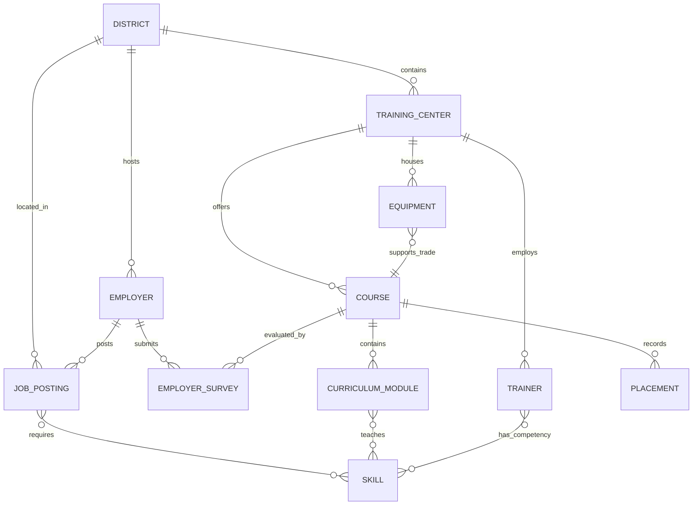

# Synthetic Demo Data — for demonstration only.

## Skill Sync AI: Synthetic Demonstration Ecosystem

> [!IMPORTANT]
> **DISCLAIMER: Synthetic Demo Data — for demonstration only.**  
> All company entities, institution codes, job vacancies, salaries, instructor profiles, and placement records in this dataset are **entirely synthetic**, created solely for algorithmic evaluation, UI demonstration, and automated test validation of the **Skill Sync AI** platform.  
> **No real-company claims or proprietary industrial metrics are represented.**

---

## 1. Purpose of the Dataset

**Skill Sync AI** bridges the disconnect between regional industry labor demand and public vocational training (ITIs, polytechnics, and skill centers). To demonstrate the platform's multi-layered decision intelligence without exposing proprietary or sensitive data, this dataset provides a **closed-loop, fully interconnected synthetic ecosystem**.

The data demonstrates how real-world labor market frictions propagate through:
1. **Demand Radar:** Captures surging, stable, and declining industrial skill requirements.
2. **Curriculum X-Ray:** Pinpoints exact theory and practical hour deficits in registered course syllabi.
3. **Skill Graph (React Flow):** Visualizes relational graphs linking Districts $\leftrightarrow$ Employers $\leftrightarrow$ Job Roles $\leftrightarrow$ Skills $\leftrightarrow$ Courses $\leftrightarrow$ Modules $\leftrightarrow$ Trainers $\leftrightarrow$ Equipment.
4. **What-If Simulator:** Models the ripple effects of shifting industry demand (+30% EV, +25% Robotics) on training seats, trainers, and equipment budgets.
5. **Candidate Career Paths:** Provides non-guaranteed, evidence-backed roadmaps identifying current vs. missing skills and practical lab projects.
6. **Employer Validation:** Captures authentic employer confirmation/rejection evidence on platform recommendations.

---

## 2. Interconnected Entity-Relationship Architecture



Every entity in this dataset connects to other entities using clean, foreign-key relationships.

---

## 3. Demonstration Scenarios & Gap Storylines

### Scenario A: Industrial Robotics & Automation (Coimbatore, Tamil Nadu)
* **The Situation:** Precision automation in Coimbatore's automotive and precision engineering corridor is surging.
* **Employer:** `Precision Multi-Axis Robotics Ltd (Synthetic Entity)` posts **28 vacancies** for *Industrial Robotics Automation & 6-Axis Arm Programmers* (₹4,20,000 – ₹6,80,000/yr).
* **Required Skills:** `Industrial Robotics Programming` (High Demand), `5-Axis CNC Milling` (High Demand), `Pneumatics & Hydraulics Basics` (Stable).
* **Course:** `POLY-TN-CBE-04` offers `ROB-CNC-301` (*Industrial Robotics & Multi-Axis CNC Automation*).
* **Interconnected Gaps Identified by Skill Sync AI:**
  1. **Capacity Gap:** Sanctioned annual intake is only **40 seats**, while regional vacancies across robotics and CNC exceed **120+ openings** (3:1 demand-to-capacity deficit).
  2. **Equipment Gap:** The lab has 2 KUKA 6-axis articulated robot arms, but **1 is marked `needs_maintenance`** and the facility's DMG Mori 5-axis mill is **`non_operational`** awaiting spindle repair.
  3. **Trainer Gap:** Senior instructor `K. Murugesan` has 12 years of CNC expertise but lacks certification in 6-axis teach pendant programming, placing all robotics lab loading on a single instructor (`Revathi Senthil`).
* **Placement Outcome:** 38 of 40 graduates placed (95% placement rate, ₹31,000/month average salary).

---

### Scenario B: Electric Vehicle CAN Bus Telemetry (Pune, Maharashtra)
* **The Situation:** EV manufacturing hubs in Chakan and Bhosari (Pune) demand vehicle communication network diagnostic skills.
* **Employers:** `Apex Dynamics Mobility Ltd (Synthetic Entity)` and `Veloce E-Mobility Systems (Synthetic Entity)` list **57 combined vacancies**.
* **Required Skills:** `EV Battery Diagnostics` (High Demand), `Battery Management Systems (BMS)` (High Demand), `Automotive CAN Bus Protocol` (High Demand).
* **Course:** `ITI-MH-PUN-01` offers `EV-TECH-201` (*Electric Vehicle Service & Maintenance Technician*).
* **Interconnected Gaps Identified by Skill Sync AI:**
  1. **Curriculum Gap:** While Module 1 covers LOTO Safety and Module 2 covers Battery Assembly, **0 practical hours are allocated to CAN Bus Protocol Analysis**. The syllabus is missing CANoe tool training entirely.
  2. **Employer Validation:** 92% of surveyed employers confirm the deficit; `Veloce E-Mobility Systems` notes candidates cannot troubleshoot bus error frames on live vehicle harnesses.
  3. **Equipment Gap:** Center owns 4 Vector CANoe diagnostic benches, but **3 are `needs_maintenance`** due to damaged OBD-II interface cables.
  4. **Trainer Gap:** Faculty member `Sunil Deshmukh` has high-voltage safety credentials but requires a 40-hour upskilling module in digital bus analyzers.

---

### Scenario C: Legacy Carburetor & Manual Drafting Sunset (Pune & Coimbatore)
* **The Situation:** Demonstrates declining, obsolete trades requiring strategic phase-out or capacity reallocation.
* **Course 1:** `ITI-MH-PUN-01` offers `ENG-LEG-101` (*Conventional Engine Overhaul & Carburetion Trade*).
  * **Declining Skill:** `Carburetor Tuning & Overhaul`.
  * **Labor Signal:** Only 2 vacancies recorded in the entire district (`Vintage Motor Spares & Overhaul (Synthetic Entity)`), with low wages (₹15,000 – ₹15,500/month).
  * **Placement Reality:** Placement rate has collapsed from **45% (2024)** down to **34% (2025)**.
  * **Infrastructure Waste:** 4 obsolete carburetor flow benches occupy 120 sq. meters of prime workshop space.
  * **AI Recommendation:** `review_obsolete_course` $\to$ Sunset carburetor trade and reallocate 40 seats + workshop floor space to an EV Powertrain Diagnostic Annex.
* **Course 2:** `POLY-TN-CBE-04` offers `MEC-LEG-102` (*Manual Drafting & Machine Tool Turning*).
  * **Declining Skill:** `Manual Drafting on Drafting Boards`.
  * **Labor Signal:** Placement rate at 36%; 30 physical manual drafting tables are idle while CAD/CAM labs are overcrowded.

---

### Scenario D: Solar Microgrid Inverter Synchronization (Ahmedabad, Gujarat)
* **The Situation:** Transition from basic rooftop solar arrays to utility-scale smart grid net metering.
* **Employer:** `Helios CleanGrid Solutions (Synthetic Entity)` posts **30 vacancies** for *Smart Grid Solar Inverter Commissioning Engineers*.
* **Required Skills:** `Grid-Tie Solar Inverter Sizing` (High Demand), `Solar PV Array Installation` (Stable), `High Voltage Safety & Lockout/Tagout` (Stable).
* **Course:** `GSTA-GJ-AHM-02` offers `SOL-GRID-101`.
* **State of Readiness:**
  * **Equipment:** 2 newly commissioned Schneider Smart Inverter Skids and 3 operational I-V curve tracers.
  * **Curriculum:** Module 2 covers synchronization theory, but employer feedback requests 20 additional practical hours on anti-islanding relay tests.

---

### Scenario E: Hemodialysis & Biomedical Engineering (Bengaluru Urban, Karnataka)
* **The Situation:** Expansion of tertiary care and allied health equipment maintenance.
* **Employer:** `AuraHealth MedTech Devices (Synthetic Entity)` posts **20 vacancies** for *Dialysis Biomedical Calibration Specialists*.
* **Required Skills:** `Dialysis Machine Calibration` (High Demand), `Sterilization Autoclave Operation` (Stable), `Pneumatics & Hydraulics Basics` (Stable).
* **Course:** `ITI-KA-BEN-03` offers `BIOMED-DIA-201`.
* **Identified Gap:** 1 of 2 hemodialysis training simulators is `needs_maintenance`, constraining student lab rotation batches.

---

## 4. Comprehensive Data Files Catalog

All files are located in `data/synthetic_demo_dataset/`:

| File Name | Record Type | Count | Key Linkages |
| :--- | :--- | :---: | :--- |
| `districts.csv` | Geographic districts | 5 | Referenced by Employers, Centers, Postings |
| `skills.csv` | Standardized skills taxonomy | 20 | Categorized into High Demand (8), Stable (7), Declining (5) |
| `employers.csv` | Hiring enterprises | 11 | Linked to Districts and Sectors; all labeled `(Synthetic Entity)` |
| `courses.csv` | Registered vocational courses | 7 | Linked to Training Centers; includes 2 declining legacy trades |
| `curriculum.csv` | Syllabus modules & taught skills | 15 | Linked to Course Codes; theory & practical hours breakdown |
| `trainers.csv` | Vocational faculty registry | 9 | Linked to Centers; certified skills with clear gap profiles |
| `equipment.csv` | Lab equipment inventories | 12 | Linked to Centers; operational condition ratings |
| `job_postings.csv` | Unstructured vacancy demand signals | 12 | Linked to Employers, Districts, and Salary ranges |
| `placements.csv` | Cohort graduation & salary outcomes | 12 | Linked to Courses; 2024 & 2025 comparative batch metrics |
| `employer_surveys.csv` | Direct employer feedback | 7 | Linked to Employers and Course Codes |
| `synthetic_demo_dataset.json` | Consolidated relational bundle | 1 | Complete normalized object graph with manifest |

---

## 5. Data Consistency Rules Enforced

1. **Referential Integrity:**
   - Every `company_name` in `job_postings.csv` and `employer_surveys.csv` exists in `employers.csv`.
   - Every `district` in `job_postings.csv`, `employers.csv`, and `courses.csv` exists in `districts.csv`.
   - Every `course_code` in `curriculum.csv`, `placements.csv`, and `employer_surveys.csv` exists in `courses.csv`.
   - Every skill referenced in `job_postings.raw_description`, `curriculum.skills_covered`, and `trainers.skills` exists in `skills.csv`.
   - Every `training_center_code` in `courses.csv`, `trainers.csv`, and `equipment.csv` follows standard state-district numbering.

2. **Numerical & Logical Validity:**
   - `placed_graduates` $\le$ `total_graduates` across all placement records.
   - `quantity_operational` $\le$ `quantity_total` across all equipment records.
   - `salary_min` $<$ `salary_max` across all job postings.
   - `experience_min` $\le$ `experience_max` across all job postings.
   - Sum of `theory_hours` $+$ `practical_hours` across course modules aligns with total course duration hours.

---

## 6. How to Ingest or Use This Dataset

### Option A: Via the Web Ingestion UI
1. Navigate to `/ingestion` in Skill Sync AI.
2. Select the dataset type (e.g., **Job Postings**, **Courses**, **Curriculum Modules**, **Trainers**, **Equipment**, or **Placements**).
3. Upload the corresponding CSV file from `data/synthetic_demo_dataset/`.
4. The built-in client validator will verify column schemas, bounds, and magic bytes with zero errors.
5. Click **Import Records** to load into the active working state.

### Option B: Programmatic Access (Node.js / TypeScript)
```typescript
import fs from "fs";
import path from "path";

const datasetPath = path.join(process.cwd(), "data/synthetic_demo_dataset/synthetic_demo_dataset.json");
const syntheticData = JSON.parse(fs.readFileSync(datasetPath, "utf-8"));

console.log(`Loaded ${syntheticData.courses.length} synthetic courses and ${syntheticData.skills.length} skills.`);
```

### Option C: Direct PostgreSQL / Supabase Seed
Execute the matching SQL seed script located at:
`database/seeds/002_synthetic_demo_data.sql`
