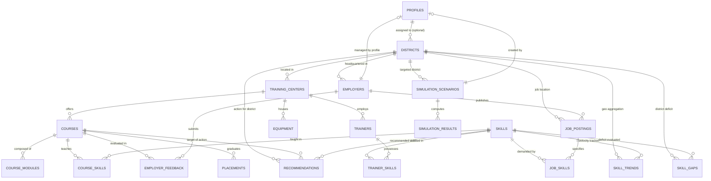

# Skill Sync AI — Database Entity-Relationship (ER) Model

**Problem Statement ID:** 26134  
**Platform:** Supabase PostgreSQL 15  
**Design Phase:** Phase 2 Production Database Architecture  

---

## 1. Visual Entity-Relationship Diagram (Mermaid)



---

## 2. Core Entities Dictionary (20 Tables)

### Geographic & Taxonomy Masters
| Table | Description | Primary Key | Key Foreign Keys & Constraints |
|---|---|---|---|
| `districts` | Master catalog of administrative districts across India with coordinates | `id (UUID)` | `UNIQUE(name, state)` |
| `skills` | Normalized master taxonomy of competencies, tools, and technical concepts | `id (UUID)` | `UNIQUE(name)`, `UNIQUE(slug)` |
| `profiles` | Stakeholder user metadata linked to Supabase Auth (`auth.users`) | `id (UUID)` | `FK -> auth.users`, `role user_role` |

### Institutional & Academic Architecture
| Table | Description | Primary Key | Key Foreign Keys & Constraints |
|---|---|---|---|
| `training_centers` | Vocational institutions, ITIs, polytechnics, and skill centers | `id (UUID)` | `FK -> districts(id)`, `UNIQUE(code)` |
| `courses` | Vocational trade programs and curricula | `id (UUID)` | `FK -> training_centers(id)`, `UNIQUE(training_center_id, code)` |
| `course_modules` | Topic breakdown of course syllabi (theory & practical hours) | `id (UUID)` | `FK -> courses(id)`, `UNIQUE(course_id, module_number)` |
| `course_skills` | Normalized M:N mapping of skills taught within courses | `id (UUID)` | `FK -> courses(id)`, `FK -> skills(id)`, `UNIQUE(course_id, skill_id)` |

### Institutional Readiness (Faculty & Infrastructure)
| Table | Description | Primary Key | Key Foreign Keys & Constraints |
|---|---|---|---|
| `trainers` | Instructors and vocational faculty members | `id (UUID)` | `FK -> training_centers(id)` |
| `trainer_skills` | Audited certifications and proficiencies of trainers | `id (UUID)` | `FK -> trainers(id)`, `FK -> skills(id)`, `UNIQUE(trainer_id, skill_id)` |
| `equipment` | Workshop machinery, diagnostic tools, and working condition status | `id (UUID)` | `FK -> training_centers(id)`, `CHECK(operational <= total)` |

### Industry Demand & Validation
| Table | Description | Primary Key | Key Foreign Keys & Constraints |
|---|---|---|---|
| `employers` | Registered industry employers and hiring organizations | `id (UUID)` | `FK -> districts(id)`, `FK -> profiles(id)` |
| `job_postings` | Granular hiring signals, vacancies, salary ranges, and job requirements | `id (UUID)` | `FK -> employers(id)`, `FK -> districts(id)` |
| `job_skills` | Normalized M:N skills extracted from job postings | `id (UUID)` | `FK -> job_postings(id)`, `FK -> skills(id)`, `UNIQUE(job_id, skill_id)` |
| `employer_feedback` | Direct employer validation loop rating curriculum relevance and gaps | `id (UUID)` | `FK -> employers(id)`, `FK -> courses(id)`, `CHECK(scores 1..5)` |

### Outcomes, Analytics & Simulation
| Table | Description | Primary Key | Key Foreign Keys & Constraints |
|---|---|---|---|
| `placements` | Historical graduate employment counts, salary medians, and hiring partners | `id (UUID)` | `FK -> courses(id)`, `UNIQUE(course_id, batch_year)` |
| `skill_trends` | Aggregated temporal demand velocity coefficients by skill and district | `id (UUID)` | `FK -> skills(id)`, `FK -> districts(id)` |
| `skill_gaps` | Deterministic supply vs demand deficits ($Demand - Supply$) | `id (UUID)` | `FK -> districts(id)`, `FK -> skills(id)`, generated `gap_net_delta` |
| `recommendations` | Explainable, auditable curriculum and capacity modification proposals | `id (UUID)` | `FK -> courses(id)`, `FK -> districts(id)`, `FK -> skills(id)` |
| `simulation_scenarios` | Budget allocation and trade capacity parameters for What-If planning | `id (UUID)` | `FK -> districts(id)`, `FK -> profiles(id)` |
| `simulation_results` | Computed projections: placement uplift, trainer gaps, and Capex requirements | `id (UUID)` | `FK -> simulation_scenarios(id)` |

---

## 3. Row-Level Security (RLS) Matrix

| User Role | Reference Data (Districts, Skills) | Job Postings & Employers | Institutional Data (Courses, Trainers, Equipment) | Outcomes & Placement | Policy Recommendations & Simulator |
|---|---|---|---|---|---|
| **Admin** | Read / Write | Full Access | Full Access | Full Access | Full Access |
| **Government** | Read / Write | Read All | Read All | Read All | Create Scenarios & Approve Recommendations |
| **Institution** | Read Only | Read All | Manage Own Training Center & Courses | Manage Own Course Placements | View Recommendations for District |
| **Employer** | Read Only | Manage Own Postings & Profile | View Public Courses & Syllabi | View Placements | Submit Feedback & Course Endorsements |
| **Candidate** | Read Only | Read Active Jobs | Read Courses & Syllabi | Read Placements | View Public Pathways & Recommendations |

---

## 4. Production vs. Demo Data Isolation Principle

Every table incorporates the column:
```sql
is_demo BOOLEAN NOT NULL DEFAULT FALSE;
```
- **Development & Hackathon Evaluation:** Sample datasets (`database/seeds/001_demo_seed.sql`) are loaded with `is_demo = TRUE`.
- **Production Queries:** When production ingestion begins, queries filter `WHERE is_demo = FALSE`.
- **Zero Accidental Contamination:** Demo records can be audited, toggled, or flushed with:
  ```sql
  DELETE FROM public.job_postings WHERE is_demo = TRUE;
  ```
  without touching any real enterprise data.
